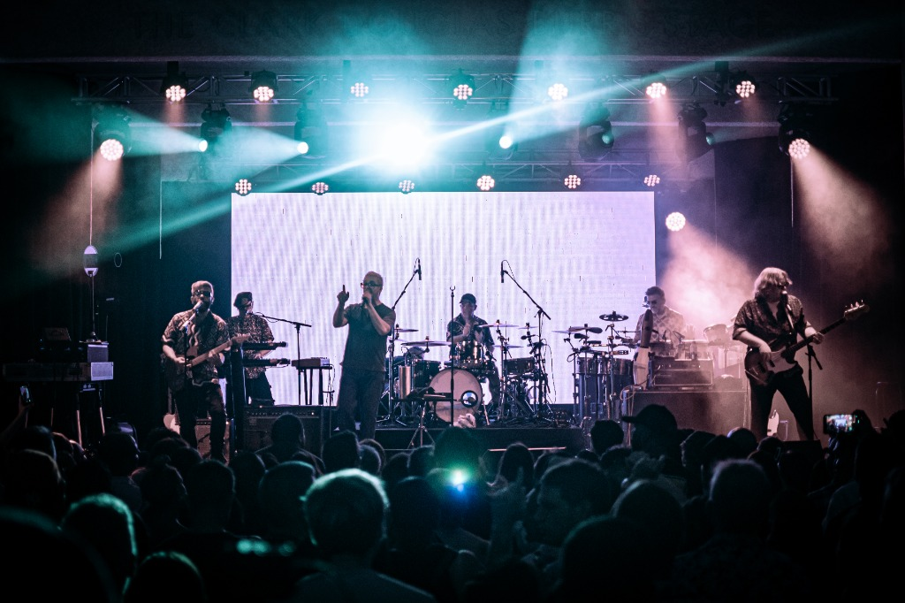
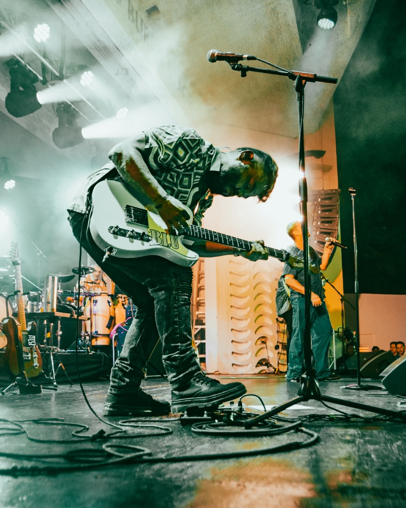

# Volumen Magazine — Optimization Report
**Generated:** April 12, 2026  
**Project:** volumen.media — Bilingual Rock Magazine, Austin TX  
**Stack:** Vanilla HTML5 / CSS3 / JS · Spline 3D · Netlify  
**Scope:** Full codebase audit across all HTML pages, assets, and Netlify config

---

## Executive Summary

Volumen is a beautifully designed, visually striking site with strong branding and solid SEO foundations already in place. The main areas to address are: **code architecture** (all CSS/JS is duplicated inline across every page), **performance** (no image format optimization, no font preloading), **accessibility** (virtually no ARIA attributes), and a few **Netlify config** gaps that create bad UX on errors.

---

## 1. Architecture — HIGH PRIORITY

### 1a. Create a shared CSS file (`styles.css`)
Every page repeats the same CSS from scratch — the cursor, grain overlay, nav, footer, CSS custom properties (`--black`, `--red`, `--gold`, etc.) — all inline, all duplicated. This makes maintenance painful: changing one color means editing 6 files.

**Fix:** Extract shared styles into a single `styles.css` and link it from every page:
```html
<link rel="stylesheet" href="styles.css">
```

### 1b. Create a shared JavaScript file (`main.js`)
The custom cursor logic and hover effects are copy-pasted into every page.

**Fix:** Move the repeated JS into `main.js` and include it at the bottom of each page:
```html
<script src="main.js" defer></script>
```

### 1c. Remove the duplicate landing page
`index.html` and `landing.html` are virtually identical — both load the same Spline scene. Only one is needed. `landing.html` can be deleted and its `sitemap.xml` entry removed.

### 1d. The language toggle is not functional
The EN/ES language buttons are labeled "visual only" in the code comments. This is the core identity of the magazine. Even a basic implementation matters here.

**Recommended approach:** Add `data-en` and `data-es` attributes to text elements, then toggle them with a simple JavaScript function. Start with the hero tagline, section headers, and nav labels before tackling full articles.

---

## 2. Performance — HIGH PRIORITY

### 2a. Add `preconnect` hints for external resources
You load fonts from Google Fonts and the Spline runtime from `esm.sh`. Without preconnect, the browser delays DNS lookup and TLS handshake until late in page load.

Add these to the `<head>` of every page:
```html
<link rel="preconnect" href="https://fonts.googleapis.com">
<link rel="preconnect" href="https://fonts.gstatic.com" crossorigin>
<link rel="preconnect" href="https://esm.sh">
<link rel="preconnect" href="https://prod.spline.design">
```

### 2b. Convert images to WebP with JPG fallback
All 12 photos are JPEG (2.2MB total). WebP reduces file size by 25–35% at equivalent quality. The largest file (`guitarist-tent.jpg` at 340KB) would drop to roughly 220KB in WebP.

**Use the `<picture>` element for progressive enhancement:**
```html
<picture>
  <source srcset="photos/guitarist-tent.webp" type="image/webp">
  
</picture>
```

**Batch convert locally (requires `cwebp`):**
```bash
for f in photos/*.jpg; do cwebp -q 82 "$f" -o "${f%.jpg}.webp"; done
```

### 2c. Add `width` and `height` attributes to all images
Missing dimensions cause Cumulative Layout Shift (CLS) — the page jumps as images load. This directly hurts Google's Core Web Vitals score.

```html
<!-- Before -->


<!-- After -->

```

### 2d. Preload the hero image — don't lazy-load it
The hero background on `home.html` (`concert-wide.jpg`) is above-the-fold and the most important visual. It should NOT be lazy-loaded — remove `loading="lazy"` from the hero image only, and add a preload hint:
```html
<link rel="preload" as="image" href="photos/concert-wide.jpg">
```

### 2e. Add a Spline timeout fallback
Currently if Spline fails to load, users see tiny "Load Failed" text. On mobile or slow connections, the 3D scene may never load at all.

**Fix — redirect after timeout:**
```javascript
const fallbackTimer = setTimeout(() => {
  window.location.href = 'home.html';
}, 8000); // redirect after 8 seconds if Spline hasn't loaded

spline.load('https://prod.spline.design/...')
  .then(() => {
    clearTimeout(fallbackTimer);
    document.body.classList.add('loaded');
  })
  .catch(() => {
    window.location.href = 'home.html'; // immediate redirect on hard error
  });
```

---

## 3. Netlify Configuration — MEDIUM PRIORITY

### 3a. Add cache headers for static assets
No `Cache-Control` headers are configured. Add these to `netlify.toml`:

```toml
[[headers]]
  for = "/photos/*"
  [headers.values]
    Cache-Control = "public, max-age=31536000, immutable"

[[headers]]
  for = "/*.css"
  [headers.values]
    Cache-Control = "public, max-age=86400"

[[headers]]
  for = "/*.js"
  [headers.values]
    Cache-Control = "public, max-age=86400"
```

### 3b. Add security headers
Free protection, zero effort:
```toml
[[headers]]
  for = "/*"
  [headers.values]
    X-Frame-Options = "DENY"
    X-Content-Type-Options = "nosniff"
    Referrer-Policy = "strict-origin-when-cross-origin"
```

### 3c. Fix the catch-all redirect
The current `/* → /index.html` catch-all means any broken or mistyped URL sends visitors to the heavy Spline loading screen instead of a useful error page.

**Fix:** Create a `404.html` page (branded, with nav), then change the catch-all in `netlify.toml`:
```toml
[[redirects]]
  from = "/*"
  to = "/404.html"
  status = 404
```

---

## 4. SEO — MEDIUM PRIORITY

### 4a. Add canonical tags to every page
No `<link rel="canonical">` exists anywhere. This is important because both `/home` and `/home.html` resolve to the same page — Google may see duplicate content.

```html
<!-- In home.html -->
<link rel="canonical" href="https://volumen.media/home">

<!-- In index.html -->
<link rel="canonical" href="https://volumen.media/">
```

### 4b. Add JSON-LD structured data (Organization schema)
Helps Google rich results and establishes Volumen as a media entity:

```html
<script type="application/ld+json">
{
  "@context": "https://schema.org",
  "@type": "Organization",
  "name": "Volumen Magazine",
  "url": "https://volumen.media",
  "description": "The first bilingual rock magazine in the US, based in Austin, Texas.",
  "sameAs": [
    "https://instagram.com/reinaldo.photos",
    "https://twitter.com/reinaldor93"
  ]
}
</script>
```

### 4c. Auto-update sitemap dates
The sitemap has hardcoded `<lastmod>2026-04-10</lastmod>` dates that will go stale fast. Consider a small build script or Netlify plugin that refreshes dates on each deploy.

---

## 5. Accessibility — MEDIUM PRIORITY

Currently there are **zero ARIA attributes** in the entire codebase. Quick fixes with high impact:

- Add `aria-label` to the nav element: `<nav aria-label="Main navigation">`
- Add `aria-current="page"` to the active nav link
- Add `:focus-visible` styles so keyboard users can see where they are (the custom cursor hides the default, but keyboard navigation still needs visible focus rings)
- Contact form inputs need visible `<label>` elements or `aria-label` attributes
- Social links open in `_blank` — add `aria-label="Instagram (opens in new tab)"` for screen reader users

---

## 6. Mobile UX — LOW PRIORITY

The navigation on mobile scales down (font shrinks to 8px) but doesn't collapse. On screens under ~380px the nav links are extremely cramped.

**Recommendation:** Add a hamburger menu for screens under 640px. The cursor is already correctly hidden on touch devices — a collapsible mobile menu is the logical next step.

---

## Quick Wins (Do These First)

| Task | Benefit | Time |
|------|---------|------|
| Add `preconnect` hints | Faster font + Spline load | 5 min |
| Remove `loading="lazy"` from hero + add `preload` | Better LCP score | 5 min |
| Add `width`/`height` to all `` tags | Eliminates layout shift (CLS) | 20 min |
| Add Spline timeout fallback | Better UX on slow connections | 15 min |
| Add `canonical` tags | Better SEO | 10 min |
| Fix catch-all redirect + create 404.html | Better error UX | 20 min |
| Add security + cache headers to netlify.toml | Security + repeat-visit speed | 10 min |

---

## Long-Term Recommendations

**Extract shared CSS/JS into separate files.** This is the biggest quality-of-life improvement as the site grows. Every new page currently requires copying ~200 lines of boilerplate.

**Implement the bilingual toggle.** It's the magazine's core identity and currently doesn't function. Even a partial implementation (hero text, nav, section headers) would be meaningful.

**Convert all images to WebP.** As you add more concert photography, this will keep the site fast without sacrificing visual quality.

**Consider Netlify CMS (Decap CMS).** Since you plan to update constantly with new interviews and editorials, a lightweight CMS will make adding content far easier than editing raw HTML files.

---

*This report was auto-generated by the Volumen scheduled optimization task. Re-run after applying fixes to track improvements.*

---

## Executive Summary

Volumen is a well-crafted, visually strong portfolio. The design language is cohesive, the bilingual identity is clear, and the deployment setup (Netlify + Lighthouse tracking) is solid. The optimizations below will improve load speed, SEO, maintainability, and accessibility without changing the look or feel of the site.

The issues are grouped by priority: **High** (fix soon), **Medium** (fix as you grow), and **Low** (nice to have).

---

## HIGH PRIORITY

### 1. Extract Shared CSS Into One External File

**Problem:** Every page (`home.html`, `editorial.html`, `contact.html`, etc.) duplicates hundreds of lines of the same CSS — the nav, cursor, grain overlay, footer, and CSS variables are copy-pasted into each `<style>` tag. This means:
- The browser can't cache shared styles between pages (re-downloads on every navigation)
- Updating the nav or brand colors requires editing every single file
- HTML files are bloated (home.html alone is ~500+ lines of CSS)

**Fix:** Create a `styles/main.css` file with all shared styles, and add a `<link>` tag to every page:

```html
<link rel="stylesheet" href="/styles/main.css">
```

Keep only page-specific styles in each file's `<style>` tag. This alone will make every page smaller and navigation feel instant due to browser caching.

---

### 2. Convert Images to WebP Format

**Problem:** All 12 photos in `/photos/` are JPEGs. The largest (`guitarist-tent.jpg`) is 338KB. Modern browsers support WebP, which gives 25–35% smaller files with the same visual quality — important for your concert photography gallery.

**Fix:** Convert each JPEG to WebP and use the `<picture>` element for fallback support:

```html
<picture>
  <source srcset="photos/guitarist-floor.webp" type="image/webp">
  
</picture>
```

You can batch-convert with: `cwebp -q 85 guitarist-floor.jpg -o guitarist-floor.webp`  
Or use Squoosh (squoosh.app) for a free browser-based converter.

**Estimated savings:** ~600KB–800KB total across all images.

---

### 3. Add `width` and `height` Attributes to All Images

**Problem:** None of the `` tags have `width` and `height` attributes. This causes **Cumulative Layout Shift (CLS)** — the page "jumps" as images load because the browser doesn't know how much space to reserve. Google PageSpeed and Core Web Vitals penalize this.

**Fix:** Add dimensions to every ``:

```html

```

---

### 4. Fix Sitemap to Use Clean URLs

**Problem:** Your `sitemap.xml` lists URLs with `.html` extensions (e.g., `volumen.media/home.html`) but your `netlify.toml` redirects clean URLs like `volumen.media/home` to those pages. Search engines will index the `.html` versions, creating potential duplicate content issues.

**Fix:** Update `sitemap.xml` to use the clean URL versions:

```xml
<loc>https://volumen.media/home</loc>  <!-- not home.html -->
<loc>https://volumen.media/editorial</loc>
<loc>https://volumen.media/interviews</loc>
```

Also remove `landing.html` from the sitemap — users never reach it directly and it's a duplicate of `index.html`.

---

### 5. Fix the Catch-All Netlify Redirect

**Problem:** In `netlify.toml`, the rule `/* → /index.html` (status 200) means that visiting any broken URL — like `/typo` or `/old-page` — silently serves the 3D Spline landing page instead of a real 404. This confuses users and hurts SEO.

**Fix:** Remove the catch-all redirect and add a proper `404.html` page instead:

```toml
# Remove this:
[[redirects]]
  from = "/*"
  to = "/index.html"
  status = 200
```

Create a `404.html` page with your brand style and a link back to home. Netlify automatically serves it for any unmatched route.

---

## MEDIUM PRIORITY

### 6. Add `rel="preconnect"` for Google Fonts

**Problem:** Each page loads fonts from Google Fonts without preconnect hints, which means the browser doesn't start connecting to `fonts.googleapis.com` until it encounters the `<link>` tag. This adds ~100–200ms of latency on first load.

**Fix:** Add these two lines above your font `<link>` tag on every page:

```html
<link rel="preconnect" href="https://fonts.googleapis.com">
<link rel="preconnect" href="https://fonts.gstatic.com" crossorigin>
<link href="https://fonts.googleapis.com/css2?family=Bebas+Neue&family=Playfair+Display:ital,wght@0,400;0,700;1,400;1,700&family=DM+Sans:ital,wght@0,300;0,400;0,500;1,300&display=swap" rel="stylesheet">
```

---

### 7. Add a Spline Fallback for Mobile and Slow Connections

**Problem:** The `index.html` 3D landing page loads Spline from an external CDN (`esm.sh`). On mobile or slow connections, the scene may never load, leaving users stuck on a black screen with "Loading Environment..." and no way to proceed — the enter button is hidden until `body.loaded` is set, which only happens after Spline loads successfully.

**Fix:** Add a timeout fallback so the enter button appears even if Spline fails to load:

```javascript
// In index.html, after spline.load():
const fallbackTimer = setTimeout(() => {
  document.body.classList.add('loaded'); // Show the button anyway
}, 8000); // 8 second timeout

spline.load('https://prod.spline.design/...')
  .then(() => {
    clearTimeout(fallbackTimer);
    document.body.classList.add('loaded');
  });
```

---

### 8. Make the Language Toggle Actually Switch Content

**Problem:** The EN/ES toggle buttons on every page only change their own visual state (one turns red) but don't actually switch any content to Spanish. Your site has beautifully written bilingual copy, but users can't browse in Spanish-only mode. This is a missed opportunity given Volumen's core identity.

**Fix (Simple):** Add `data-en` and `data-es` attributes to all bilingual text elements, and toggle their content with JS when the language button is clicked:

```html
<div class="bi-text" data-en="For the music lovers..." data-es="Para los amantes...">
  For the music lovers...
</div>
```

```javascript
document.getElementById('btn-es').addEventListener('click', () => {
  document.querySelectorAll('[data-es]').forEach(el => {
    el.textContent = el.dataset.es;
  });
});
```

---

### 9. Preload the Hero Image

**Problem:** The hero background image in `home.html` (`concert-wide.jpg`) is the largest image a user sees first, but it's not preloaded — the browser discovers it only when it parses the CSS/HTML. This delays the Largest Contentful Paint (LCP) score.

**Fix:** Add a preload hint in the `<head>`:

```html
<link rel="preload" as="image" href="photos/concert-wide.jpg">
```

Once you convert to WebP, update this to point to the `.webp` version.

---

### 10. Add `<link rel="canonical">` to Every Page

**Problem:** Since both `home.html` and `/home` serve the same content (due to Netlify redirects), search engines might see duplicate pages. A canonical tag tells them which URL is the "real" one.

**Fix:** Add to every page's `<head>`:

```html
<!-- home.html -->
<link rel="canonical" href="https://volumen.media/home">

<!-- editorial.html -->
<link rel="canonical" href="https://volumen.media/editorial">
```

---

## LOW PRIORITY (Nice to Have)

### 11. Add a Web App Manifest for PWA Support

Adds an installable "Add to Home Screen" experience on mobile. Create a `manifest.json` and link it:

```html
<link rel="manifest" href="/manifest.json">
```

This is especially impactful for a music magazine — fans checking setlists or photos at shows on mobile will appreciate it.

---

### 12. Consider Astro or 11ty for Future Scaling

As you add more content (more editorials, interviews, show coverage), maintaining everything in raw HTML will become difficult. Your README already mentions this. When you're ready, **Astro** is the best choice for this kind of content site — it's component-based but outputs pure static HTML, supports image optimization out of the box, and has zero JS by default.

---

### 13. Add `aria-label` to Icon-Only Links

The Instagram and Twitter links in the footer contain only text ("Instagram", "Twitter / X") which is fine. But the play button on `index.html` has only an SVG icon with no text and no `aria-label`:

```html
<!-- Current -->
<a href="home.html" class="play-btn" title="Enter Volumen">

<!-- Better -->
<a href="home.html" class="play-btn" title="Enter Volumen" aria-label="Enter Volumen Magazine">
```

---

## Quick Wins Summary

| Fix | Effort | Impact |
|-----|--------|--------|
| Fix sitemap clean URLs | 5 min | SEO ✅ |
| Add preconnect for fonts | 5 min | Performance ✅ |
| Add preload for hero image | 5 min | LCP score ✅ |
| Add image width/height attributes | 15 min | CLS score ✅ |
| Fix catch-all redirect + 404 page | 20 min | SEO + UX ✅ |
| Add Spline timeout fallback | 15 min | Mobile UX ✅ |
| Convert images to WebP | 30 min | Load speed ✅ |
| Extract shared CSS to file | 1–2 hrs | Maintainability ✅ |
| Implement language toggle | 2–3 hrs | Bilingual identity ✅ |

---

*Report generated by automated Volumen site analysis · April 2026*
